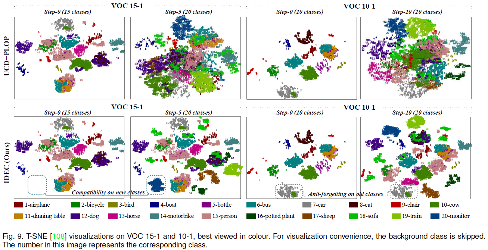

# IDEC
### Inherit With Distillation and Evolve With Contrast: Exploring Class Incremental Semantic Segmentation without Exemplar Memory. 2023.

Danpei Zhao<sup>1,2*</sup>, Bo Yuan<sup>1,2</sup>,  Zhenwei Shi<sup>1</sup>.

<sup>1</sup> <sub>Image Processing Center, BUAA</sub><br />
<sup>2</sup> <sub>Airvic Lab</sub><br />

Continual semantic segmentation (CSS) based on incremental learning is a great endeavour in developing human-like segmentation models. However, current CSS approaches encounter challenges in the trade-off between preserving old knowledge and learning new ones, where they still need large-scale annotated data for incremental learning (IL) and lack interpretability. In this paper, we present \textit{Learning at a Glance} (LAG), an efficient, robust, human-like and interpretable approach for CSS. Innovatively, LAG is a simple architecture and model-agnostic, yet it achieves competitive CSS efficiency with limited incremental data. Inspired by human-like recognition patterns,  we propose a semantic-invariance modelling approach via semantic features decoupling that simultaneously reconciles solid knowledge inheritance and new-term learning. Concretely, the proposed decoupling manner includes two ways, i.e.,  channel-wise decoupling and spatial-level neuron-relevant semantic consistency. Our approach preserves semantic-invariant knowledge as solid prototypes to alleviate catastrophic forgetting, while also constraining sample-specific contents through an asymmetric contrastive learning method to enhance model robustness during incremental steps. Experimental results in multiple benchmarks validate the effectiveness of the proposed model, and the interpretability of the model also proves the IL efficiency of LAG. Furthermore, we also introduce a novel CSS protocol that better reflects realistic data-limited CSS settings, and LAG achieves superior data-limited CSS performance on new classes with 180\% improvement to the current state-of-the-art.


### Update 2023-08-02

## Results


## pretrained models

| Task        | Total IL steps   | model 
|-------------|---------|-----------
| VOC 15-5    | 2       | link    
| VOC 15-1    | 6       | [BaiduYun](https://pan.baidu.com/s/1zvusmhzKrCWQDPnUKQnZCQ)[fetchcode: 6lc3]  [GoogleDrive](https://drive.google.com/drive/u/0/folders/1JHQYep21cWuK97HX2xWLf9QacG3HQVCs) 
| VOC 5-3     | 5       | link    
| VOC 10-1    | 11      | [BaiduYun](https://pan.baidu.com/s/1h4UYJcRtD_Kzz0OWAHOtig)[fetchcode: 55ld]  
| ADE 100-50  | 2       | link 
| ADE 100-10  | 6       | link   
| ADE 50-50   | 3       | link  
| ADE 100-5   | 11      | link   
| ISPRS 4-1   | 2       | link    
| ISPRS 2-3   | 2       | [BaiduYun](https://pan.baidu.com/s/14_-FFm-O2Rz_3Mqt4ls5Wg)[fetchcode: vxge]    
| ISPRS 2-2-1 | 3       | [BaiduYun](https://pan.baidu.com/s/1jYQlj9x-VadharG9RVdjeg)[fetchcode: snz4]  
| ISPRS 2-1   | 4       | [BaiduYun](https://pan.baidu.com/s/1qPz1XqgIBkYW92-Zh6ZUcA)[fetchcode: h8st]    

More on the way.

## Inference
```sh inference.sh```

## Train
```sh run.sh```

## License
©2022 Airvic *All Rights Reserved*


